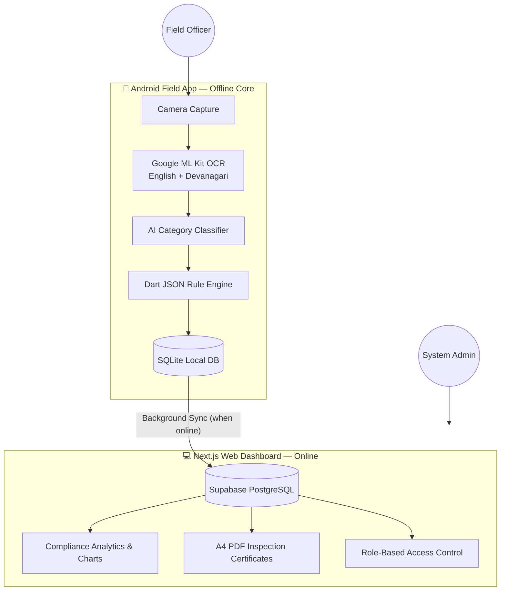

# 🔍 RuleScan 

**Team Kamchalau Coders** 

> **Tagline:** Scan it. Check it. Prove it.
> **Vision:** An offline-first compliance assistant that turns packaged-commodity labels into explainable, evidence-backed decisions under the *Legal Metrology (Packaged Commodities) Rules, 2011* — for every packaged commodity, not just food.

---

## 📑 Table of Contents

- [System Architecture](#️-system-architecture--working-flow)
- [How It Works](#how-it-works-the-inspection-pipeline)
- [Folder Structure](#-folder-structure)
- [Prototype vs. Production](#️-hackathon-prototype-vs-production-reality)
- [Features Implemented in MVP](#-features-fully-implemented-in-this-mvp)
- [Known Issues & Tech Debt](#-known-issues--tech-debt)
- [Research & References](#-research--references)
- [Live Links](#-live-links)
- [How to Run Locally](#️-how-to-run-the-app-locally)

---

## 🏗️ System Architecture & Working Flow

RuleScan is designed to operate in low-connectivity environments (warehouses, godowns, remote fields). The core intelligence lives **on-device**, while analytics and reporting sync to the cloud only when internet is available.



### How It Works (The Inspection Pipeline)

| Step | Description |
|---|---|
| 1. **Capture** | Field officer photographs a product label using the Android app. |
| 2. **On-device OCR + AI** | Google ML Kit extracts text (English & Hindi), entirely offline. A local classifier categorizes the product (e.g. *Packaged Food*, *Cosmetics*). |
| 3. **Rule Evaluation** | The native Dart engine parses LMPC rules from local JSON files and checks mandatory declarations (MRP, Net Qty, Best Before, etc.). |
| 4. **Offline Storage** | The result, with geotagged photo evidence, is stored in local SQLite. |
| 5. **Cloud Sync** | Once online, the app silently syncs data to the central Supabase database. |
| 6. **Dashboard Overview** | Admins log into the Next.js dashboard for real-time compliance metrics, top violated rules, and PDF reports. |

---

## 📂 Folder Structure

```text
SIH/rulescan/
│
├── app/rulescan_app/          # 📱 FLUTTER MOBILE APP (Field Officers)
│   ├── android/               # Native Android config (ProGuard rules, permissions)
│   ├── assets/                # Local JSON LMPC rules & offline ML models
│   └── lib/
│       ├── rule_engine.dart   # Native Dart offline rule parser
│       ├── sync_service.dart  # Background SQLite → Supabase bridge
│       └── pages/             # UI screens (Scanner, Review, History, etc.)
│
├── web/                       # 💻 NEXT.JS WEB DASHBOARD (Admins & Viewers)
│   ├── src/app/                # App Router pages (Dashboard, Admin panel)
│   ├── src/context/            # Auth context (Supabase JWT integration)
│   └── src/lib/                # Utilities (PDF generation, Supabase client)
│
├── backend/rule-engine/       # ⚙️ RULE ENGINE & ADAPTERS
│   ├── rules/                  # Master JSON definitions of LMPC rules
│   └── json_adapter.js         # Translates JSON into executable logic
│
├── ml/hf-classifier/          # 🧠 AI CATEGORY CLASSIFIER
│   └── classifier.py           # Hugging Face transformer inference script
│
├── setup_supabase.js          # 🗄️ Database schema & RLS policy setup script
└── README.md
```

---

## ⚠️ Hackathon Prototype vs. Production Reality

Transparent breakdown of what's built for the demo vs. what production would need:

### 1. AI Categorization
- **Demo:** Pre-trained Hugging Face `EcommerceClassifier` (400+ generic e-commerce buckets), mapped into LMPC-specific categories via a lookup layer.
- **Production:** A custom-trained, lightweight TFLite model trained on Indian FMCG + Legal Metrology categories for on-device inference and higher accuracy on niche categories (Paints, Cement, etc.).

### 2. Rule 7 — Numeral & Letter Height
- **Demo:** OCR extracts text; officer manually confirms font-size compliance against the area-based table.
- **Production:** Computer-vision-based measurement using a reference object (ID card / coin) in-frame to calculate real millimeter height automatically.

### 3. E-Commerce Declarations (Rule 6(10))
- **Demo:** Officer uploads a screenshot from Blinkit/Amazon, passed through the same OCR engine.
- **Production:** Automated scraper — officer pastes a product URL, system scrapes the listing for mandatory declarations.

### 4. Legal Notices & Workflow
- **Demo:** Dashboard generates A4 PDF "Inspection Certificates."
- **Production:** Integration with state e-Governance mail servers — auto-generated DOCX legal notices dispatched to the manufacturer's registered email.

---

## ✅ Features Fully Implemented in this MVP

- **100% offline mobile core** — camera, ML Kit OCR, and JSON rule parsing work with zero internet.
- **Local SQLite → Supabase sync** — graceful handling of network drops; scans live on-device until sync is possible.
- **Role-based access control (RBAC)** — Supabase JWT auth separating `ADMIN` (all state data) and `EMPLOYEE` (own field scans only).
- **Dynamic Next.js analytics** — compliance rate, category distribution, and "Top Violated Rules," computed live from synced data.
- **Barcode integration** — ML Kit barcode scanning cross-references community product databases (Open Food Facts / Open Beauty Facts) for convenience, while OCR remains the sole authority for compliance decisions.

---

## 🐞 Known Issues & Tech Debt

Documented honestly so nothing gets lost after the hackathon:

| Issue | Impact | Workaround (current) | Real fix (planned) |
|---|---|---|---|
| `sync_service.dart` uses `auth.currentUser!.id` | Crashes if session expires mid-scan | Fresh login before any live demo | Null-safe session check with re-auth prompt |
| Rule 7 font-height is officer-confirmed, not measured | No hard automated pass/fail on letter height | Treated as advisory-only flag | Reference-object calibration (Phase 2) |
| AI classifier trained on generic e-commerce data | Lower accuracy on niche categories (cement, paints) | Manual override always available to officer | Fine-tune on self-collected field-photo dataset |
| Community barcode DBs (Open Food/Beauty Facts) have sparse regional-brand coverage | Barcode lookup often returns "not found" | Falls back to normal OCR label scan | Grow local cache organically from field scans |

---

## 📚 Research & References

1. Legal Metrology (Packaged Commodities) Rules, 2011 — full text, [indiacode.nic.in](https://indiacode.nic.in)
2. [EasyOCR](https://github.com/JaidedAI/EasyOCR) — multi-script OCR (English, Devanagari, regional)
3. [retail-product-classifier](https://github.com/MariosVisos/retail-product-classifier) — packaged product image classification
4. [json-rules-engine](https://github.com/CacheControl/json-rules-engine) — JSON-based rule evaluation
5. [Measuring-Size-of-Objects-with-OpenCV](https://github.com/Practical-CV/Measuring-Size-of-Objects-with-OpenCV) — reference-object measurement technique
6. [Open Food Facts](https://world.openfoodfacts.org) / [Open Beauty Facts](https://world.openbeautyfacts.org) — free, open barcode-to-product databases

---

## 🔗 Live Links

| Resource | Link |
|---|---|
| Live dashboard demo | *https://kamchalaucoders.netlify.app/* |
| Demo video | *https://youtu.be/fyHWOhiEd2U* |

---

## 🛠️ How to Run the App Locally

### 1. Database Setup

Backend runs on Supabase. To initialize tables and RLS policies:

```bash
node setup_supabase.js
```

### 2. Mobile App (Flutter)

Requires Flutter SDK and an emulator or physical device (USB debugging enabled).

```bash
cd app/rulescan_app/example
flutter pub get
flutter run
```

> A compiled `rulescan.apk` is also available for direct download via the web dashboard's landing page.

### 3. Web Dashboard (Next.js)

Requires Node.js 18+.

```bash
cd web
npm install
npm run dev
# Dashboard live at http://localhost:3000
```

---

<p align="center"><sub>Built for Smart India Hackathon 2026 · Team Kamchalau Coders · SIH26034</sub></p>
